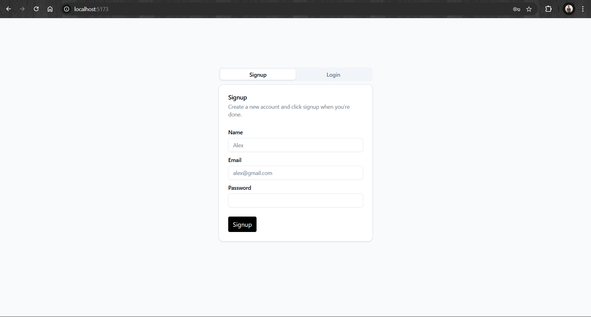
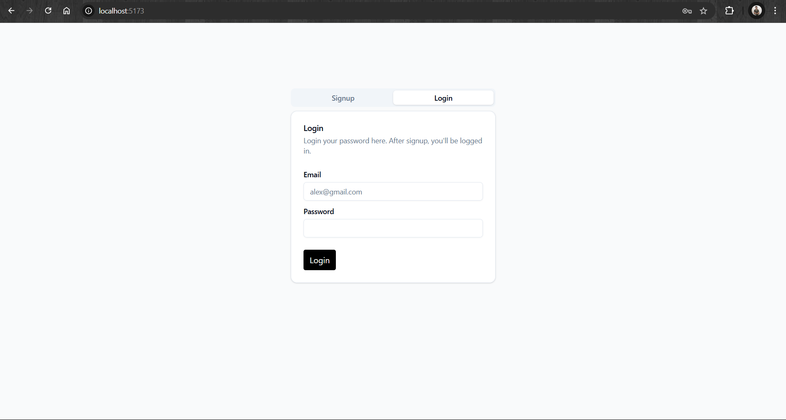
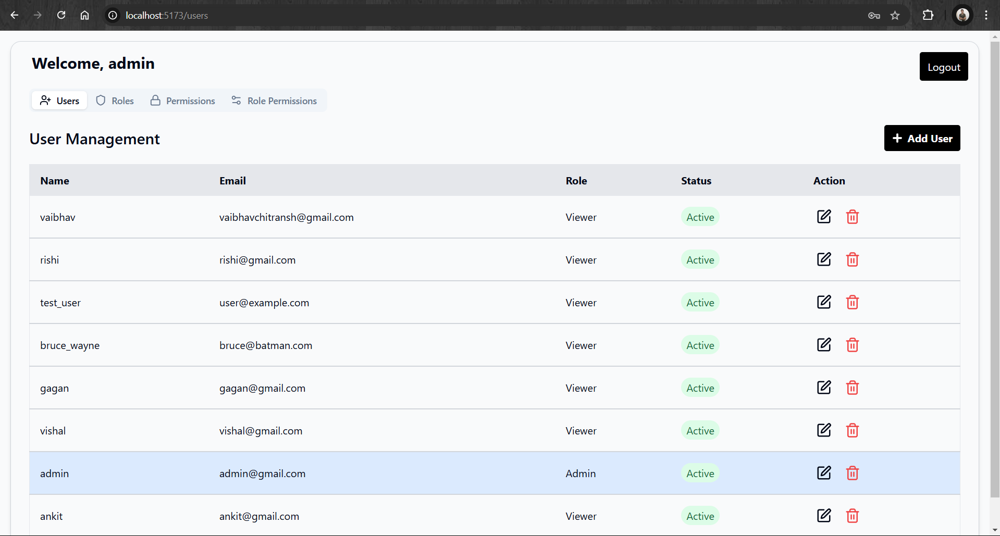
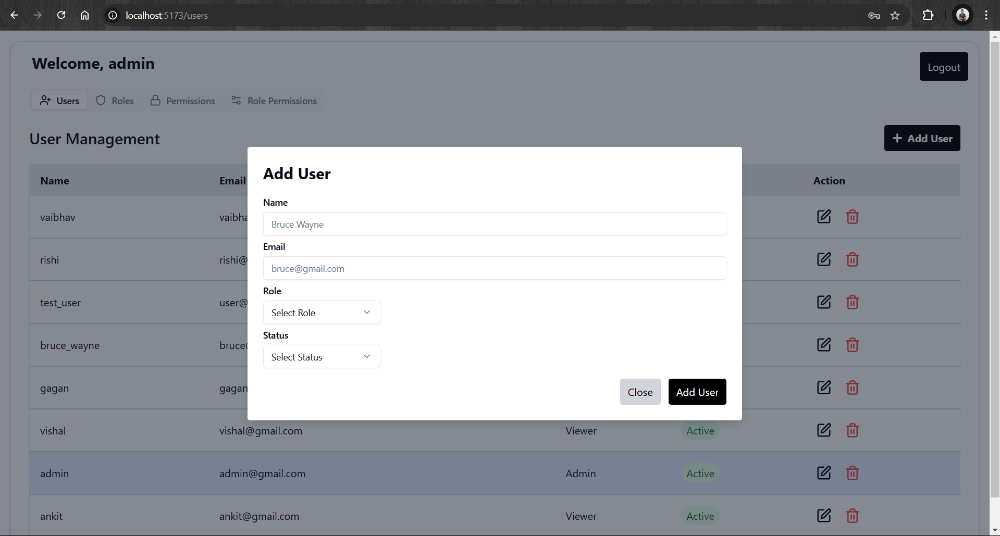
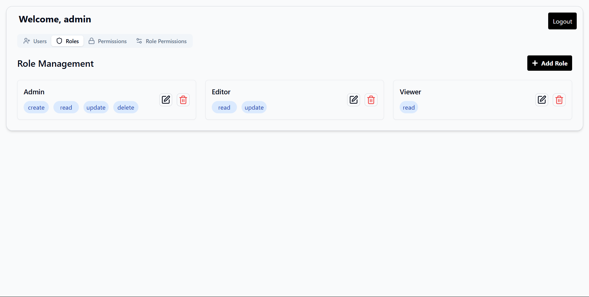
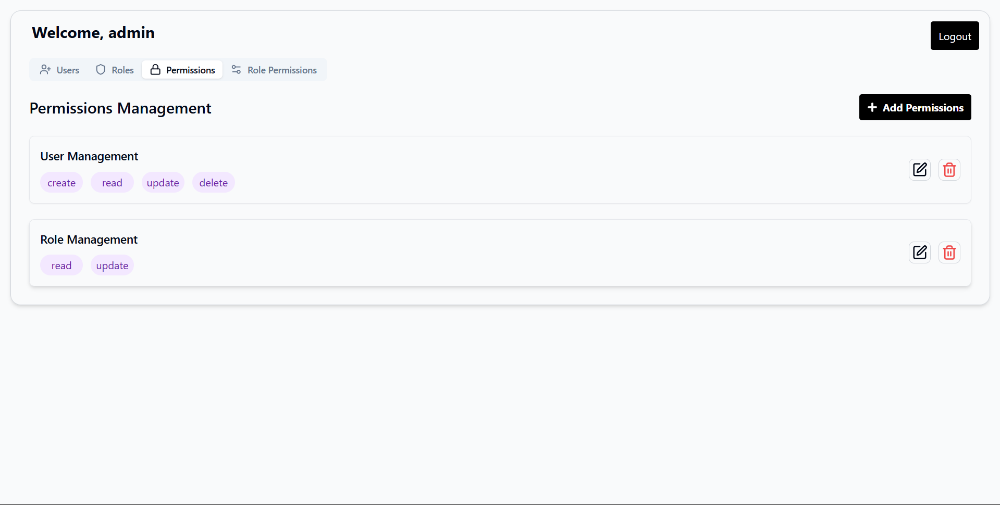
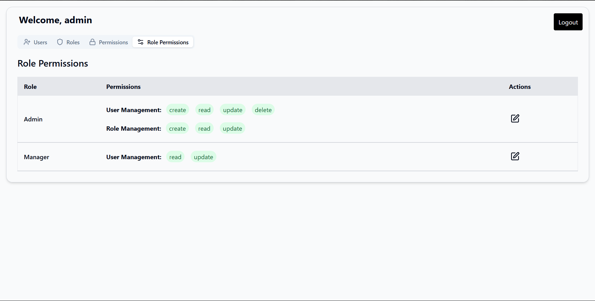
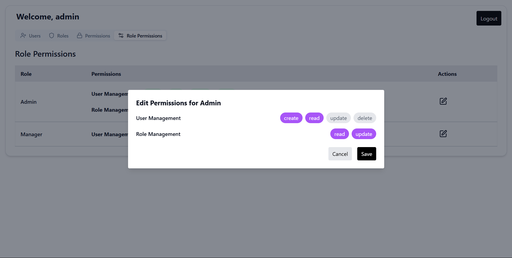

# User Management System

## Overview

The **User Management System** is a robust web application designed to streamline user, role, and permission management. It employs a **Role-Based Access Control (RBAC)** framework to enhance security and ensure seamless access control. Administrators can efficiently manage users, assign roles, and define permissions through an intuitive and feature-rich interface.

## Features

### User Registration
- **Description**: Enables new users to register and create accounts securely.
- **Key Highlights**: 
  - Form validation for user inputs.
  - Secure password hashing using industry-standard techniques.

### User Login
- **Description**: Secure login system for registered users.
- **Key Highlights**: 
  - JWT-based authentication for session handling.
  - Error handling for invalid credentials.

### Role Management
- **Description**: Allows administrators to create, update, and delete roles.
- **Key Highlights**: 
  - Dynamic role addition with real-time updates.
  - Role-based segregation to ensure least-privilege access.

### Permission Management
- **Description**: Assign specific permissions to roles to control access.
- **Key Highlights**: 
  - Granular permission assignments for maximum flexibility.
  - Integration with the backend to ensure secure role-permission mapping.

### User Management
- **Description**: Admins can manage user accounts, including editing and deletion.
- **Key Highlights**: 
  - Bulk user actions for efficient management.
  - Visual insights into user activity and role assignments.

### Dashboard
- **Description**: A bird's-eye view of user statistics and role distributions.
- **Key Highlights**: 
  - Graphical representation of user data.
  - Real-time updates powered by RESTful APIs.

## Screenshots

Below are snapshots showcasing various features of the system:


**User Registration Page**


**User Login Page**


**Admin Dashboard**


**Add User Tab**


**Role Management Page**


**Permissions Management Page**


**Role Permissions Management Page**


**Edit Role Permissions Tab**

## Getting Started

To set up the User Management System locally, follow these steps:

### Prerequisites
Ensure the following tools are installed on your system:
- **Node.js** (v22.6.0 or higher)
- **npm** (v10.8.2 or higher)
- **MongoDB** (or any compatible database)

### Backend Setup

1. Clone the repository:
   ```bash
   git clone https://github.com/Vaibhav-Chitransh/User-Management-System.git
2. Navigate to the server directory:
   ```bash
   cd User-Management-System/server
3. Install dependencies:
   ```bash
   npm install
4. Create a .env file and configure the following environment variables:
   ```bash
   PORT=3000
   MONGO_URI=<your_mongo_connection_string>
   SECRET_KEY=<your_jwt_secret>
5. Start the server:
   ```bash
   npm start

### Client Setup

1. Navigate to the client directory
   ```bash
   cd User-Management-System/client
2. Install dependencies:
   ```bash
   npm install
3. Start the client-side application:
   ```bash
   npm start
4. Open your browser and visit:
   ```bash
   http://localhost:3000

### Project Structure

User-Management-System/
├── server/
│   ├── controllers/
│   ├── models/
│   ├── routes/
│   ├── database/
│   ├── middleware/
│   └── server.js
├── client/
│   ├── src/
│   │   ├── components/
│   │   ├── pages/
│   │   ├── lib/
│   │   ├── assets/
│   │   ├── App.js
│   │   ├── index.js
│   └── public/


###Contributing

We welcome contributions to enhance the project! Please follow these steps:

1. Fork the repository.
2. Create a feature branch:
   ```bash
   git checkout -b feature-name
3. Commit your changes:
   ```bash
   git commit -m "Add new feature"
4. Push the branch
   ```bash
   git push origin feature-name
5. Create a pull request.

###Contact

For any queries or suggestions, feel free to reach out:

Author: Vaibhav Chitransh
GitHub: [User-Management-System](https://github.com/Vaibhav-Chitransh/User-Management-System)


